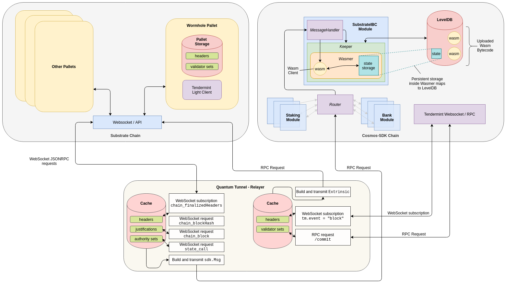

# Wormhole: A Cosmos-Substrate bridge

## What is Wormhole?
Wormhole is a bridge to connect a Substrate-based blockchain to a Cosmos-SDK based blockchain. Specifically it connects
substrate light client running inside cosmos chain to substrate chain and cosmos light client running inside substrate chain to cosmos chain.
 

## Architecture
The Wormhole bridge, comprises three parts:
  - [A fork of Gaia](https://github.com/ChorusOne/gaia), with an additional module to allow execution of wasm-based light clients.
  - [Wormhole](https://github.com/ChorusOne/wormhole), a Substrate-based chain, including a tendermint-client pallet.
  - [Quantum-tunnel](https://github.com/ChorusOne/quantum-tunnel), a simple relayer, written in rust.
  - [Tendermint light client](https://github.com/ChorusOne/tendermint_light_client), light client for tendermint based chain, written in rust, referenced by tendermint-client pallet in Wormhole.
  - [Substrate light client](https://github.com/ChorusOne/substrate-ibc-client), light client for substrate based chain, written in rust as CosmWasm contract. Its wasm bytecode need to be uploaded to Gaia fork as part of bridge setup.
  


## Demo
In order to run the demo, clone this repository, and run following command:
```
# Fetches submodules
git submodule init 
git submodule update

# Cleans data directory and shuts down any stray docker containers.
make clean

# Builds docker images, could take a while.
make build

# Runs a demo
make run
```

## Integration tests
Before running integration test, docker images are needed to be built with `make build`.
There are five integration test variants you can run:

### Live
Both chains are live. To run this variant you need to execute `make test_live` in project directory.
Note that this test will not terminate automatically, which provides tester opportunity to check both chain's status.

### Simulated cosmos
Cosmos chain is simulated with a text file and headers are fed into cosmos light client running in substrate chain. To run this variant you need to execute `make test_simulated_cosmos`. If the test is successful, docker compose will exit with zero exit code.

### Simulated substrate
Substrate chain is simulated with a text file and headers are fed into substrate light client running in cosmos chain. To run this variant you need to execute `make test_simulated_substrate`. If the test is successful, docker compose will exit with zero exit code.

### Faulty simulated cosmos
Same as simulated cosmos but with faulty data to test failure scenario. To run this variant you need to execute `make test_faulty_simulated_substrate`. If the test is successful, docker compose will exit with zero exit code.

### Faulty simulated substrate
Same as simulated substrate but with faulty data to test failure scenario. To run this variant you need to execute `make test_faulty_simulated_cosmos`. If the test is successful, docker compose will exit with zero exit code.


## Credit and Attribution
- Substrate - Web3 Foundation, Parity
- Cosmos-SDK - All in Bits, Tendermint Inc., Interchain.io, Interchain Foundation
- Cosmwasm - Confio, Ethan Frey and Simon Warta
- Tendermint-rs - Informal Systems
- Concept of Wasm-based light client - Zaki Manian, Iqclusion


